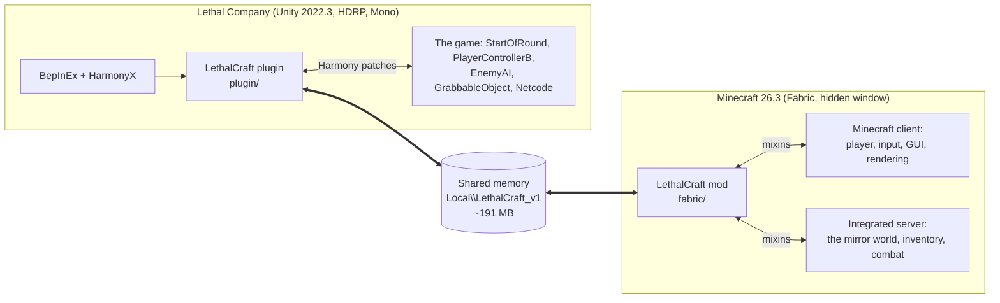
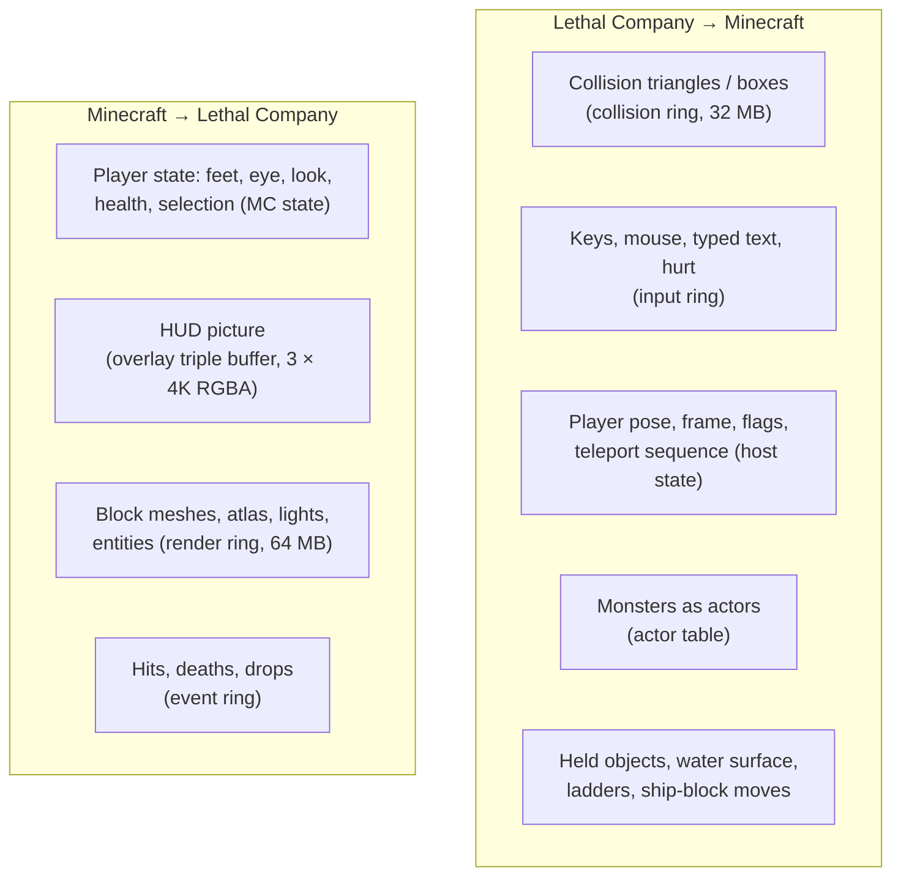
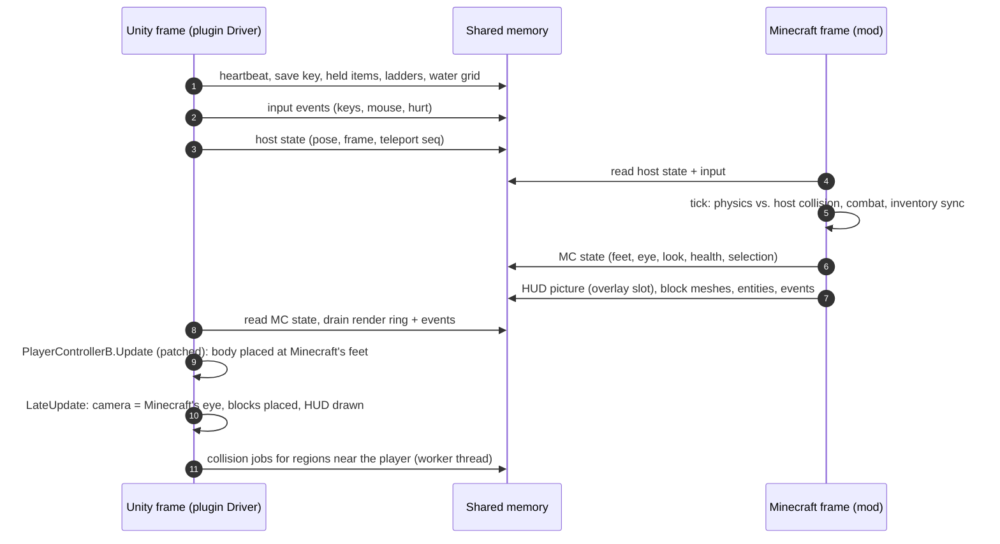
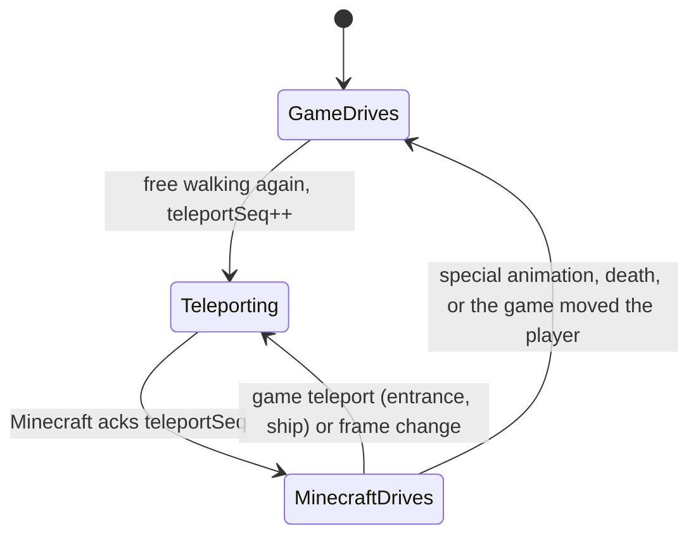
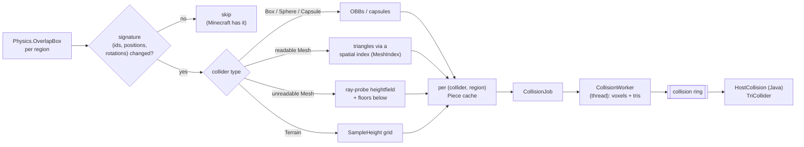
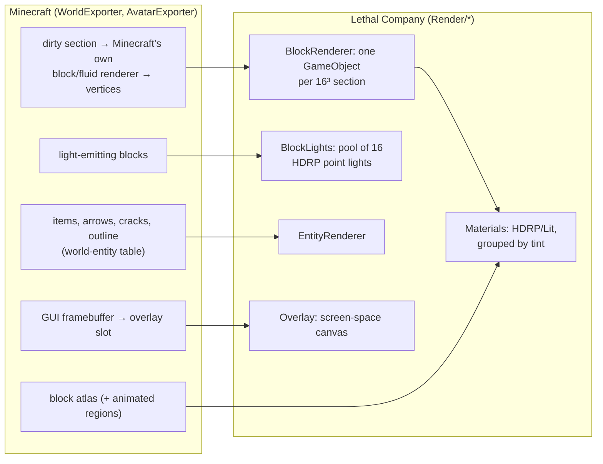
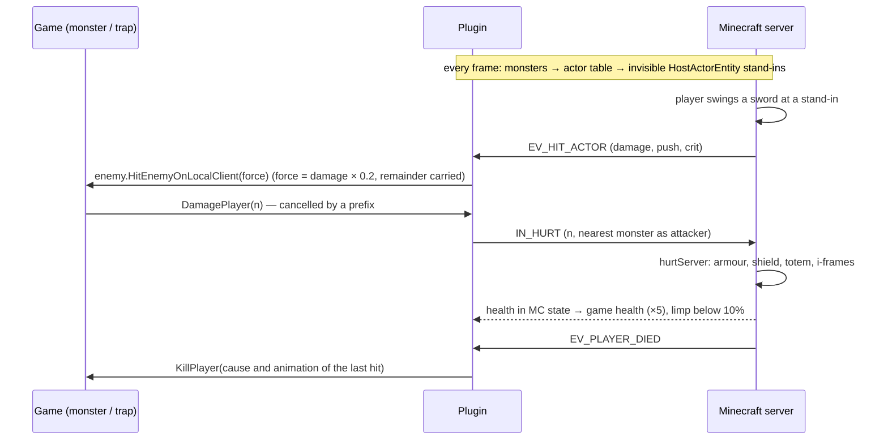
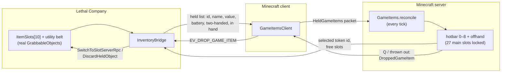
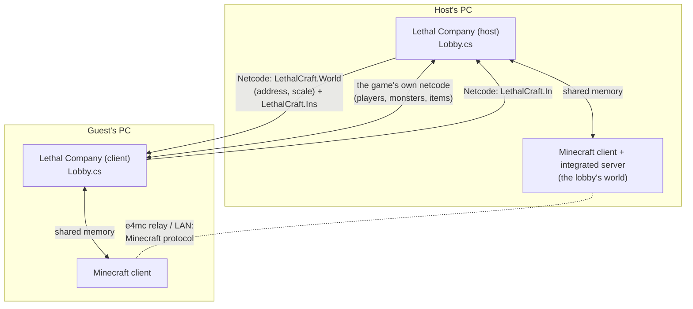

# LethalCraft

Play **Lethal Company as a Minecraft character.**

LethalCraft runs a real Minecraft (Java Edition, Fabric) hidden alongside Lethal Company and links the two.
The player is a full Minecraft player: Minecraft's movement and physics, health, hunger, armour, swimming and
drowning, its hotbar, its blocks and its weapons. Lethal Company supplies the world: the ship, the moons, the
facility, the monsters, the scrap, the quota and the co-op lobby.

- Walk, sprint, sneak and jump with Minecraft's physics on Lethal Company's terrain, stairs and catwalks.
- Build with Minecraft blocks anywhere. They are drawn inside Lethal Company and lit by its lights, and torches and lava light the facility.
- Ride the mineshaft's elevator, or any other moving platform, and the blocks built on it ride along. Blocks built on the ship travel with the ship. Blocks left on a moon or in its facility are gone when the ship leaves, as the game makes the moon anew.
- Fight monsters with Minecraft swords, axes and bows. Armour, shields and totems protect you, and one health bar (Minecraft's) is your life.
- Carry scrap and tools in your Minecraft hotbar, each with its own icon, value and battery bar, and use them with right click.
- Climb ladders by walking into them, and swim in Lethal Company's water with Minecraft's air bubbles.
- Each Lethal Company save has its own Minecraft world, so your inventory and hunger belong to that save.
- In multiplayer the whole lobby plays in one Minecraft world, the host's. Everyone sees the same blocks, and each
  other as Minecraft players.

> **Status: early and experimental.** LethalCraft is a fork of [RepoCraft](#credits) (itself a fork of SkyCraft),
> adapted to Lethal Company. Single-player is playable end to end. Shared-world multiplayer is new and less tested
> (see [Multiplayer](#multiplayer)). There is no packaged release yet: you build it from source.

---

## Contents

- [Requirements](#requirements)
- [Installation](#installation)
- [Playing](#playing)
- [Multiplayer](#multiplayer)
- [Configuration](#configuration)
- [Troubleshooting](#troubleshooting)
- [How it works (developers)](#how-it-works-developers)
  - [Architecture](#architecture)
  - [The link: shared memory](#the-link-shared-memory)
  - [One frame, end to end](#one-frame-end-to-end)
  - [The puppet: Minecraft drives the player](#the-puppet-minecraft-drives-the-player)
  - [Coordinates, frames and slots](#coordinates-frames-and-slots)
  - [Collision: Lethal Company's world in Minecraft](#collision-lethal-companys-world-in-minecraft)
  - [Rendering: Minecraft's world in Lethal Company](#rendering-minecrafts-world-in-lethal-company)
  - [Input](#input)
  - [Health, combat and death](#health-combat-and-death)
  - [The one inventory](#the-one-inventory)
  - [Ship blocks, ladders and water](#ship-blocks-ladders-and-water)
  - [Per-save worlds](#per-save-worlds)
  - [Multiplayer: one Minecraft world per lobby](#multiplayer-one-minecraft-world-per-lobby)
  - [Code map](#code-map)
  - [Building and the dev loop](#building-and-the-dev-loop)
  - [Changing the protocol](#changing-the-protocol)
- [Credits and license](#credits-and-license)

---

## Requirements

| What | Version | Notes |
|---|---|---|
| Lethal Company | current Steam build (Unity 2022.3) | You must own it. |
| [r2modman](https://thunderstore.io/package/ebkr/r2modman/) | any | Used to create a clean BepInEx profile. |
| BepInEx | 5.4.23 (installed by r2modman) | The plugin loader for Lethal Company. |
| [Prism Launcher](https://prismlauncher.org/) | any recent | Runs the hidden Minecraft. |
| Minecraft: Java Edition | **26.3** | On a Microsoft account that owns it. |
| Fabric Loader | **0.19.5** | |
| Fabric API | **0.161.0+26.3** | |
| e4mc | 6.2.x (Fabric, 26.1–26.3) | For multiplayer over the internet (the host's world gets a public link). Without it, shared worlds work on a LAN only. |
| Java | **25** | For Minecraft, Prism can download it for you. For building, install a JDK 25. |
| Windows | 10 / 11 | The link uses Windows shared memory. |

To build from source you also need the **.NET SDK 8** (or newer) and a **JDK 25** (for Gradle).

The Minecraft versions above are pinned in [`fabric/gradle.properties`](fabric/gradle.properties) and will move on
over time. If something doesn't load, check those first.

## Installation

LethalCraft has two halves, and both are needed:

1. **The Lethal Company plugin** (`plugin/`, C#) is a BepInEx plugin.
2. **The Minecraft mod** (`fabric/`, Java) is a Fabric mod for the hidden Minecraft.

There's no packaged release yet, so you build both from this repository. Setup takes about 20 minutes the first
time.

### 1. Get the build tools and the source

1. Install the **[.NET SDK](https://dotnet.microsoft.com/download) 8** or newer. Check it in a terminal:
   `dotnet --version`.
2. Install a **JDK 25** (for example [Microsoft Build of OpenJDK](https://learn.microsoft.com/java/openjdk/download)
   or [Adoptium](https://adoptium.net/)). Set `JAVA_HOME` to it, or make it the first `java` on your `PATH`, so
   Gradle uses it. Check it with `java -version`, which should say 25.
3. Clone this repository:

   ```powershell
   git clone <this repository's URL> LethalCraft
   cd LethalCraft
   ```

### 2. Lethal Company side: a BepInEx profile

1. Install **[r2modman](https://thunderstore.io/package/ebkr/r2modman/)**, choose Lethal Company, and **create a new
   profile**. The install script assumes it's named **`LethalCraftDev`**; any name works if you pass `-Profile`
   below. Don't add other mods to it at first. r2modman installs BepInEx into the profile on its own.
2. Click **Start modded** once, wait for the game's main menu, and quit. This makes BepInEx create its folders,
   `...\r2modmanPlus-local\LethalCompany\profiles\<profile>\BepInEx\` (`core`, `plugins`, `config`).
3. Note where Lethal Company is installed (Steam: right-click it → *Manage* → *Browse local files*). You'll pass it
   as `-GameDir`.

### 3. Minecraft side: a Prism Launcher instance

1. Install **[Prism Launcher](https://prismlauncher.org/)** with its **installer**, which installs to
   `%LOCALAPPDATA%\Programs\PrismLauncher`, where LethalCraft looks for it. (`C:\Program Files\PrismLauncher` is
   found too. For a portable Prism anywhere else, see `Launcher` in [Configuration](#configuration).)
2. In Prism, open **Accounts** (top right) and **add your Microsoft account**. It must own Minecraft: Java Edition.
3. Click **Add Instance** and set:
   - **Name: `LethalCraft`**, exactly this name, because the plugin starts it with `prismlauncher.exe --launch LethalCraft`;
   - **Version: 26.3**;
   - **Mod loader: Fabric**, version **0.19.5**.
4. Select the instance, click **Edit**, and change its settings:

   | Page | Setting | Value |
   |---|---|---|
   | **Settings → Java** | tick **Java arguments** and enter | `--enable-native-access=ALL-UNNAMED -Dlethalcraft.startHidden=true` |
   | **Settings → Java** | Java installation | **Java 25**. Leave *Auto-detect* on and let Prism download it, or pick your JDK 25. |
   | **Settings → Memory** | tick **Memory**, maximum memory allocation | **4096 MB** (at least 3072) |
   | **Settings → Console** | tick **Console window**, untick *Show console while the game is running* | so no console pops up when the game starts Minecraft |

   What the two Java arguments do:
   - `--enable-native-access=ALL-UNNAMED` lets the mod use Java's foreign-function API, which it uses to open the
     shared memory it talks to Lethal Company through (`OpenFileMappingW`). Without it, Java 25 warns at startup,
     and later Java versions are set to refuse it.
   - `-Dlethalcraft.startHidden=true` keeps Minecraft's window hidden and its title music silent from the very first
     frame, before the link to Lethal Company is up. Without it, the window shows for a moment and then hides
     itself when the game links up.
5. Still in **Edit**, open **Mods → Download mods** and add, from Modrinth:
   - **Fabric API** `0.161.0+26.3` (required);
   - **e4mc** `6.2.x` for Minecraft 26.3. You need this to **host** multiplayer over the internet, and you can skip
     it otherwise.
6. **Launch the instance once from Prism.** Prism downloads Minecraft, Fabric and Java. Because of `startHidden`, the
   game window won't appear on its own. Wait about a minute, then close it from Prism (**Kill**). This first launch
   only has to download everything and create the instance's `minecraft` folder. If you'd like to watch it start,
   remove `-Dlethalcraft.startHidden=true` for this run.

### 4. Build and install LethalCraft

From the repository root, in **PowerShell**:

```powershell
.\tools\install-dev.ps1 -GameDir "C:\Program Files (x86)\Steam\steamapps\common\Lethal Company" -Profile "LethalCraftDev"
```

If PowerShell refuses to run the script (*"running scripts is disabled on this system"*), run this once:
`Set-ExecutionPolicy -Scope CurrentUser RemoteSigned`.

The script:

- makes a *publicized* copy of the game's `Assembly-CSharp.dll` (its private members made public, to compile
  against) in `.tools/`. It reads the game's DLL from `-GameDir` and doesn't change it;
- builds the plugin and copies `LethalCraft.dll` into the profile's `BepInEx\plugins\LethalCraft\`;
- builds the Fabric mod (Gradle downloads itself and Minecraft's libraries the first time, which takes a few
  minutes) and copies `lethalcraft-<version>.jar` into the Prism instance's `minecraft\mods` folder.

| Parameter | Default | Meaning |
|---|---|---|
| `-GameDir` | `D:\Steam\steamapps\common\Lethal Company` | Your Lethal Company install. |
| `-Profile` | `LethalCraftDev` | The r2modman profile. |
| `-PrismData` | `%APPDATA%\PrismLauncher` | Prism's data folder (where `instances\` is). For a portable Prism, its own folder. |
| `-SkipPlugin` / `-SkipFabric` | | Build only one half. |

When it's done, the instance's `minecraft\mods` folder should hold three jars: `fabric-api-…`, `lethalcraft-…`, and
`e4mc-…` if you added it.

### 5. Play

1. Close Prism, or leave it open; either works.
2. Start Lethal Company **from r2modman** (*Start modded*, with your LethalCraft profile selected). Starting it from
   Steam directly runs it without BepInEx.
3. The plugin starts Prism's `LethalCraft` instance by itself, hidden. Minecraft opens its world in the background,
   and once you're in a game its HUD (hotbar, hearts, hunger) appears over Lethal Company. Closing Lethal Company
   saves and closes Minecraft.

The first time you load each save there's a short pause while Minecraft creates that save's world, and you get the
starter kit. The very first time, there's also a few-second resource reload while Minecraft builds the pack of
Lethal Company item icons.

**Launching Minecraft by hand.** With `startHidden` set, starting the `LethalCraft` instance from Prism runs
Minecraft invisibly, waiting for Lethal Company. That's intended, because Lethal Company normally starts it. If
Minecraft is already running when you start the game, the plugin uses it.

### Updating

Pull the latest source and run `.\tools\install-dev.ps1` again. It replaces both halves. Check
[`fabric/gradle.properties`](fabric/gradle.properties) in case the Minecraft, Fabric or Fabric API versions moved.
If they did, update the Prism instance (*Edit → Version*) and Fabric API to match.

### Where things are, and uninstalling

| What | Where |
|---|---|
| The plugin | `%APPDATA%\r2modmanPlus-local\LethalCompany\profiles\<profile>\BepInEx\plugins\LethalCraft\` |
| Its settings | `...\profiles\<profile>\BepInEx\config\dev.lethalcraft.cfg` |
| Its log | `...\profiles\<profile>\BepInEx\LogOutput.log` |
| The Minecraft mod | `%APPDATA%\PrismLauncher\instances\LethalCraft\minecraft\mods\lethalcraft-<version>.jar` |
| Minecraft's worlds (one per save: `LethalCraft-<key>`) | `...\instances\LethalCraft\minecraft\saves\` |
| Minecraft's log | `...\instances\LethalCraft\minecraft\logs\latest.log` |
| The item-icon resource pack | `...\instances\LethalCraft\minecraft\resourcepacks\lethalcraft-items\` (rebuilt automatically) |
| Item icons drawn by the game | `%LOCALAPPDATA%\LethalCraft\item-icons\` |

To uninstall, delete the r2modman profile and the Prism instance, and optionally `%LOCALAPPDATA%\LethalCraft`.
Lethal Company itself, and its saves, are never modified. Its saves only gain one extra key (`LethalCraftWorld`)
that the game ignores.

## Playing

You are a Minecraft player. Minecraft's default keys are yours, and Lethal Company's actions are fitted around them:

| Key | Does |
|---|---|
| W A S D, Space, Left Ctrl, Left Shift | Minecraft movement: walk, jump, sprint, sneak |
| Mouse | Look (Minecraft's sensitivity and FOV) |
| 1–9, mouse wheel | Minecraft hotbar, Lethal Company items included |
| E | Minecraft inventory (press E again to close) |
| Q | Drop the selected item. For a Lethal Company item, the game drops the real object. |
| Left click | Attack / mine (Minecraft) |
| Right click on a door, button, lever, terminal or scrap | The game's interact / grab |
| Right click on a locked door holding a key or lock picker | Unlock it / place the lock picker |
| Right click with a Lethal Company item | Use it: flashlight, airhorn, shovel swing, walkie-talkie, … |
| Sneak + right / left click with a Lethal Company item | Its secondary / tertiary use (the game's Q / E: shotgun safety and reload, …) |
| Right click anywhere else | Minecraft's use / place block |
| Middle click | The game's scan |
| / (the game's chat) | Chat. Each line also goes to Minecraft's chat; a line starting with `/` is a Minecraft command (Minecraft only). |
| T, / | Minecraft's chat. It's the lobby's chat too: lines go out through the game's chat (its 25 m range, walkie-talkies, the dead and the living apart), and the game's own chat box is hidden. `/` commands are Minecraft's. |
| F5 | Third person |
| Walk into a ladder | Climb it (sneak to hold on) |

**The inventory.** You only have the **hotbar and the offhand**: the 27 main inventory slots are locked, for
Minecraft and Lethal Company items alike. Crafting and armour slots still work. Each Lethal Company object is one
item (it doesn't stack), shows the game's own icon, its scrap value in the tooltip, and battery charge as the
durability bar. If the hotbar is full you can't pick anything up ("Hotbar full!"). Two-handed scrap locks the
hotbar until you drop it. Lethal Company items can't go into chests or crafting grids.

**Health.** There is one health bar, Minecraft's: 20 Minecraft health = the game's 100. Monster hits and traps are
Minecraft damage, so armour, shields and totems work. When Minecraft's player dies, the game's player dies with
the same cause of death, and the other way round. Falls follow Minecraft's rules.

**Blocks.** You start each new world with a hotbar kit (sword, pickaxe, bow, arrows, food, planks, cobblestone,
torches, lanterns), a shield and iron armour. Blocks go anywhere the game has collision, are solid to the game's monsters (they path around your walls and can't see through them), light the game's world,
and travel with the ship. A moon is made anew every day, so what you leave on it (blocks, holes dug into it, dropped
items) is cleared when the ship leaves. Only what's on and around the ship comes along.

## Multiplayer

A Lethal Company lobby plays in **one Minecraft world: the host's**. There's nothing to set up beyond installing
LethalCraft. Host or join a lobby from the game's menu as usual, Steam or LAN, and the Minecraft side follows by
itself:

1. When the first friend joins your lobby, your hidden Minecraft opens its world to them. With e4mc, the world gets
   a public link (`something.e4mc.link`). Without e4mc, it gets your LAN address.
2. Your game sends the address to everyone in the lobby. Their hidden Minecraft leaves its own world and joins
   yours. This takes a few seconds; until then they play on in their own world.
3. From then on everyone shares the same Minecraft world:
   - everyone sees the same blocks, including the ones on the ship;
   - players appear to each other as Minecraft players, wearing their skins and armour and holding their items, in
     place of their Lethal Company bodies;
   - Minecraft weapons hit the same monsters.
4. When the lobby ends, guests' Minecraft goes back to their own world.

**Requirements and notes:**

- **Every player needs LethalCraft** (both halves), and **their own Minecraft account**. Two players on the same
  account can't be in one Minecraft world. LethalCraft also gives every player 10 item slots, which the game syncs
  by slot number, so a player without the mod would see the wrong items in other players' hands.
- **Over the internet:** the host needs **e4mc** in their Prism instance's `mods` folder. **On a LAN:** e4mc isn't
  needed, but the host's firewall must let other PCs reach the Minecraft port.
- **Whose world:** the host's. It's the world that goes with the host's save file, so blocks built together stay in
  that save. Each guest's inventory, health and hunger in it belong to that guest, as on any Minecraft server.
- **Damage and death:** each player's Minecraft health is their own. Guests' hits on monsters are applied through
  their own game, so the game credits the right player and the hits sync to everyone.
- **Opting out:** set `[Multiplayer] ShareWorld = false` to keep everyone in their own Minecraft world. Lethal Company
  multiplayer still works, but you won't see each other's blocks.

**Testing multiplayer** needs two PCs, each with its own Lethal Company copy and Minecraft account. Both logs say
what's happening:

- the host's `LogOutput.log`: `lobby: our Minecraft world is the lobby's (…)`;
- a guest's: `lobby: in the host's Minecraft world (…)`;
- `latest.log`: `hosting a Lethal Company lobby: world opened to friends on port …` or `Lethal Company lobby plays in …; joining`.

## Configuration

`BepInEx\config\dev.lethalcraft.cfg` in your r2modman profile. It's created the first time the game starts with
LethalCraft.

| Section | Key | Default | Meaning |
|---|---|---|---|
| Minecraft | `StartWithGame` | `true` | Start (and stop) the hidden Minecraft with the game. |
| Minecraft | `Launcher` | *(empty)* | Empty: Prism from its usual folder. Or a full path to Prism, MultiMC or a `.bat`. |
| Minecraft | `LauncherArguments` | `--launch LethalCraft` | What to pass the launcher. |
| World | `BlocksPerMeter` | `0.72` | Scale: makes the 2.5 m game player as tall as Minecraft's 1.8 blocks. |
| Combat | `DamageToEnemies` | `0.2` | The game's hit force per Minecraft damage point (a shovel hit is 1). |
| Combat | `DamageToPlayer` | `1` | Multiplier on the game's damage before Minecraft takes it. |
| Multiplayer | `ShareWorld` | `true` | The lobby plays in the host's Minecraft world. Off: everyone stays in their own. |
| Debug | `Diagnostics` | `false` | A state line in the log every 2 s. |
| Debug | `ShowMinecraftWindow` | `false` | Keep Minecraft's window visible, to watch what it's doing. Takes effect at the next game start. |

**Minecraft-side switches** go in the Prism instance's **Java arguments**, next to the two required ones. The
environment variables are mostly for testing.

| Switch | Default | Meaning |
|---|---|---|
| `--enable-native-access=ALL-UNNAMED` | *(required)* | Lets the mod open the shared memory (Java's foreign-function API). |
| `-Dlethalcraft.startHidden=true` | *(recommended)* | No window and no title music from the first frame. |
| `-Dlethalcraft.showWindow=true` | off | Never hide the window (debugging; same as `ShowMinecraftWindow`). |
| `-Dlethalcraft.quitWithHost=false` | `true` | Keep Minecraft running after Lethal Company closes. |
| `-Dlethalcraft.link=Local\Name` / env `LETHALCRAFT_LINK` | `Local\LethalCraft_v1` | The shared-memory name. Set the same on both sides to run a second pair on one PC. |
| env `LETHALCRAFT_LAN_HOST` | auto | The address a host without e4mc advertises (e.g. `127.0.0.1` for a second client on the same PC). |
| `-Dlethalcraft.lanOffline=true` / env `LETHALCRAFT_LAN_OFFLINE` | off | A hosted world accepts offline-mode (dev) clients. |

## Troubleshooting

**Logs.** Lethal Company: `BepInEx\LogOutput.log` in the profile. Minecraft: `logs\latest.log` in the Prism
instance's `minecraft` folder.

| Symptom | Look for |
|---|---|
| No Minecraft HUD | `latest.log`: `still not in the mirror world; current screen …` means Minecraft is stuck on a screen. Turn on `ShowMinecraftWindow` to see it. |
| HUD flickers on and off | `LogOutput.log`: repeated `Minecraft disconnected` / `connected` means Minecraft's heartbeat stalled for more than 3 s. |
| Minecraft never starts | `LogOutput.log`: `no Minecraft launcher found` or `starting Minecraft: …`. Check that Prism is in `%LOCALAPPDATA%\Programs\PrismLauncher` (or set `Launcher`), and that the instance is named exactly `LethalCraft`. |
| Minecraft starts but never links (no HUD, `latest.log` shows no `linked to Lethal Company`) | Check the instance's Java arguments include `--enable-native-access=ALL-UNNAMED`, and that `lethalcraft-<version>.jar` and Fabric API are in its `minecraft\mods` folder. |
| A Minecraft window flashes up at startup | Add `-Dlethalcraft.startHidden=true` to the instance's Java arguments. |
| `install-dev.ps1`: `No BepInEx in r2modman profile` | Start the game modded from that profile once first, or pass the right `-Profile`. |
| `install-dev.ps1`: Gradle fails with a Java version error | `JAVA_HOME` isn't a JDK 25. |
| `PlayerControllerB.Update has N CharacterController.Move calls, expected 1` | The game updated and the movement patch no longer fits. Report it. |
| Walls where there are none, or falling through floors | Turn on `Diagnostics`. `collision:` lines name slow or unreadable meshes. |
| A guest never gets into the host's world | Guest's `LogOutput.log`: `couldn't reach the host's Minecraft world` means the address isn't reachable. Over the internet the host needs e4mc; on a LAN, check the host's firewall. |

---

# How it works (developers)

This part starts with the big picture and gets more detailed as it goes. Paths are relative to the repository
root. The plugin targets `netstandard2.1` (the game's Mono). The mod targets Java 25 and Minecraft 26.3, with
Mojang's names.

## Architecture

Two processes on one PC, joined by one block of Windows shared memory:



**Who owns what:**

| Lethal Company owns | Minecraft owns |
|---|---|
| The world: terrain, ship, facility, doors, water | The player's body: position, velocity, collisions, jumping, swimming |
| Monsters and their AI | The player's health, hunger, air, armour, death |
| Its objects (scrap, tools) and their networking | The inventory (hotbar + offhand), with tokens for the game's objects |
| The camera's *placement* (which it takes from Minecraft) | The camera's view: eye height, bob, FOV, third person |
| The lobby, the save, the quota | Blocks built by the player and their light |
| The 3D picture (HDRP renders Minecraft's blocks too) | The HUD picture (hotbar, hearts, screens) |

The design rule: **the player is a Minecraft character, and Lethal Company supplies the world.** Lethal Company's
state for the player (its position, its health, its HUD) is presentation and sync for the other players. When a
system has to be designed, it's designed the way it works in Minecraft.

Data flows both ways every frame:



## The link: shared memory

The plugin **creates** the mapping `Local\LethalCraft_v1` at startup. The Minecraft mod **opens** it once it
appears, and treats the game as gone when the game's heartbeat stops. The layout is a set of fixed offsets, mirrored
by hand in [`plugin/src/Link/Proto.cs`](plugin/src/Link/Proto.cs) and
[`fabric/src/main/java/dev/lethalcraft/link/Proto.java`](fabric/src/main/java/dev/lethalcraft/link/Proto.java).
The header magic is `"LTHC"` and the current version is 12.

```text
offset      region                 writer  form
0x00000     header                 both    magic, version, PIDs, heartbeats, multiplayer, save key
0x00100     host state             LC      seqlock: flags, player pose, teleport seq, viewport
0x00200     MC state               MC      seqlock: feet, eye, look, flags, health, selection, camera
0x00300     overlay control        both    triple-buffer indices
0x00400     water grid             LC      seqlock: 16x16 surface heights around the player
0x00840     ladders                LC      seqlock: up to 24 climbable boxes
0x00B00     ship-block move        LC      one request (seq written last)
0x00C00     held game items        LC      seqlock: up to 11 objects (id, flags, value, battery, name)
0x01000     input ring             LC      SPSC ring of input events
0x12000     actor table            LC      up to 256 monsters (id, box, yaw, name)
0x17000     event ring             MC      hits, deaths, drops
0x1C000     world entities         MC      seqlock: items, arrows, cracks, outline
0x20000     collision ring         LC      32 MB, SPSC: per-region triangle/box/capsule jobs
+32 MB      overlay pixels         MC      3 x 3840x2160 RGBA slots (triple buffer)
+3 slots    render ring            MC      64 MB, SPSC: atlas, sections, lights, textures, scene
```

Three patterns cover everything:

- **Seqlocks** carry small state that's rewritten every frame. The writer bumps the sequence number to odd, writes,
  then bumps it to even. Readers retry when the number is odd or changes mid-read.
- **Single-producer, single-consumer rings** carry streams: input, events, collision, render. The producer owns
  `head` and the consumer owns `tail`. A full ring makes the producer wait, briefly for render data, so the consumer
  must always drain.
- **A triple buffer** carries the HUD picture, so neither side waits on the other.

A seqlock write, from the plugin:

```csharp
// plugin/src/Link/SharedLink.cs
uint* seq = (uint*)(b + Proto.GiSeq);
uint v = *seq;
Volatile.Write(ref *seq, v + 1);   // odd: being written
Thread.MemoryBarrier();
// ... fields ...
Thread.MemoryBarrier();
Volatile.Write(ref *seq, v + 2);   // even: stable
```

…and the reader, in the mod:

```java
// fabric/src/main/java/dev/lethalcraft/link/HostLink.java
int seq1 = (int) INT.getAcquire(s, b + GI_SEQ);
if ((seq1 & 1) != 0) { Thread.onSpinWait(); continue; }
// ... read fields ...
VarHandle.loadLoadFence();
if ((int) INT.getAcquire(s, b + GI_SEQ) == seq1) return true;   // consistent
```

**Lifecycle.** [`Launcher.cs`](plugin/src/Launcher.cs) starts Prism with `--launch LethalCraft`. The mod links up,
hides its window, opens or creates its *mirror world* ([`MirrorWorld.java`](fabric/src/client/java/dev/lethalcraft/client/MirrorWorld.java)),
and quits a few seconds after the game does. The plugin considers Minecraft gone after 3 s without a heartbeat.
The mod waits 8 s, because the game's loading screens can stall its heartbeat.

## One frame, end to end



The plugin's whole per-frame flow is in [`plugin/src/Driver.cs`](plugin/src/Driver.cs), a `MonoBehaviour` on a
`DontDestroyOnLoad` object. `Update` runs the link, frame and slot selection, the puppet, combat, inventory, water,
ladders and collision. `LateUpdate` runs input, hiding the arms and HUD, and placing blocks and lights.

## The puppet: Minecraft drives the player

The game's `PlayerControllerB.Update` is one big method, and its movement happens in exactly one
`CharacterController.Move` call. A Harmony **transpiler** replaces that single call with our own:

```csharp
// plugin/src/Patches/PlayerPatches.cs
private static IEnumerable<CodeInstruction> Transpiler(IEnumerable<CodeInstruction> instructions)
{
    foreach (var ins in instructions)
    {
        if ((ins.opcode == OpCodes.Callvirt || ins.opcode == OpCodes.Call) && ins.operand is MethodInfo m && m == OriginalMove)
        {
            ins.opcode = OpCodes.Call;
            ins.operand = Replacement;      // PlayerUpdatePatch.Move
        }
        yield return ins;
    }
}

public static CollisionFlags Move(CharacterController controller, Vector3 motion)
{
    if (!Puppet.Active)
        return controller.Move(motion);                  // the game drives
    return controller.Move(Puppet.OnGround ? Vector3.down * 0.05f : Vector3.zero);   // only grounding contact
}
```

A postfix then puts the body at Minecraft's interpolated feet ([`Player/Puppet.cs`](plugin/src/Player/Puppet.cs),
[`Player/TickInterpolator.cs`](plugin/src/Player/TickInterpolator.cs)). It drives the game's animator from
Minecraft's state (walking, sprinting, crouching, in the air), so other players see a normal Lethal Company player
moving the Minecraft way. Look input is Minecraft's mouse formula. The camera is placed at Minecraft's eye with its
bob and FOV, or behind or in front of you in third person.

**Who drives** is arbitrated every frame. Minecraft drives when the player is free-walking. The game drives during
its special animations: the terminal, the ship lever, cutscenes, death. Hand-overs use a **teleport handshake**:



The game's own `TeleportPlayer` (entrances, the ship) is caught by a postfix, which releases the puppet and
re-syncs Minecraft to the new place. If Minecraft ever falls more than 48 blocks below where it last stood (a hole
in the collision), it's put back.

## Coordinates, frames and slots

[`Coords.cs`](plugin/src/Coords.cs) converts everything: Unity uses metres, Y up, Z forward (left-handed);
Minecraft uses blocks, Y up, Z south (right-handed). Z is mirrored, so triangle winding flips. The scale is
`BlocksPerMeter = 0.72`.

The ship **moves**: it descends, takes off and sits in orbit. Minecraft's world doesn't. So Minecraft's coordinates
are relative to a **frame**, and each frame gets its own **slot**, a separate stretch of the Minecraft world along
X:

```mermaid
flowchart LR
    subgraph MCW["One Minecraft world (per save)"]
        S0["slot 0 (x ≈ 0)<br/>the ship's own space<br/>(in flight)"]
        S1["slot 1 (x ≈ 4096)<br/>moon levelID 0"]
        S2["slot 2 (x ≈ 8192)<br/>moon levelID 1"]
        SN["…"]
    end
    SHIP["Ship moving<br/>(orbit, landing, take-off)"] -->|Frame = elevatorTransform| S0
    MOON["Ship landed, or<br/>player off the ship"] -->|Frame = world,<br/>OffsetX = (levelID+1)·4096| S1
```

```csharp
// plugin/src/Coords.cs
public static void ToMc(Vector3 u, out double x, out double y, out double z)
{
    Vector3 l = Frame != null ? Frame.InverseTransformPoint(u) : u;   // into the frame's own space
    x = l.x * K + OffsetX;      // each frame in its own slot
    y = l.y * K;
    z = -l.z * K;               // Z mirrored
}
```

The ship counts as "landed" once it has been still for 0.5 s, and stops counting when it leaves. Then the frame
switches, the collision is resent, and Minecraft is teleported into the other slot. Because everything in the ship
frame is ship-local, riding the ship down is smooth, with no jitter from a moving collision mesh.

**Moving platforms** (the mineshaft's elevator, the Company Cruiser's bed, modded lifts) work the same way, in a slot
of their own at x ≈ −4096 ([`World/Platforms.cs`](plugin/src/World/Platforms.cs)):

- **What counts as one:** the game's own moving-platform region (`PlayerPhysicsRegion`, which sets the player's
  `physicsParent`), or else the topmost parent of the collider under the player's feet that moved since the last
  frame. Lifts without a physics region work too.
- **When the frame switches:** once it has moved under the player for 0.15 s, it becomes the frame. In a frame, the
  collision exporter sends only the frame's own colliders, including a vehicle's physics body. Once the platform has
  been still for 0.5 s, or the player has been off it for 0.3 s, the moon's frame comes back, so walking on and off
  a stopped lift needs no switching.

## Collision: Lethal Company's world in Minecraft

Minecraft needs to collide with Lethal Company's geometry. [`World/CollisionExporter.cs`](plugin/src/World/CollisionExporter.cs)
harvests the colliders around the player into **regions** (8×8×8 blocks). It does this within a radius of 4 regions
horizontally, from 3 below to 2 above. The regions go to the Minecraft side through the collision ring.



Details that matter:

- **The layer mask** comes from the player layer's own physics collision matrix, so the player collides with
  exactly what the game's player collides with. Triggers, non-kinematic rigidbodies, players and grabbable objects
  are skipped.
- **Unreadable meshes** (most of the game's build is unreadable) are probed with rays from above, at 0.25 blocks
  (0.5 for meshes over 40 m). Each ray continues down through up to three more floors, so floors under ceilings
  exist too.
- **Moving things** (doors, the ship door) are re-checked every 0.25 s in the regions next to the player, including
  the region above the player's feet, where their head is. A changed signature resends the region.
- **Surface materials** from collider tags ride in the triangle flags, so Minecraft plays matching footstep sounds
  ([`HostFootsteps.java`](fabric/src/client/java/dev/lethalcraft/client/HostFootsteps.java)).
- On the Java side, the player uses the smooth triangle collider
  ([`TriCollider.java`](fabric/src/main/java/dev/lethalcraft/world/TriCollider.java)). Other entities use voxels.

## Rendering: Minecraft's world in Lethal Company

Minecraft does the meshing, and Lethal Company does the drawing:



- **One root object** holds all of Minecraft's geometry, with children placed at Minecraft coordinates scaled to
  metres. Each `LateUpdate`, after the ship has moved, `BlockRenderer.Place` puts the root where Minecraft's origin
  is in the current frame. That's how blocks ride the ship.
- **HDRP.** The game renders with HDRP, so RepoCraft's built-in-pipeline shaders don't render here. Blocks use
  `HDRP/Lit`, set up at runtime with `HDMaterial.SetSurfaceType`, `SetAlphaClipping` and `ValidateMaterial`, as
  opaque, cutout and translucent variants. `HDRP/Lit` ignores vertex colour, so Minecraft's biome tint comes back as
  a material colour: triangles are grouped by tint, and each group is a submesh with its own material. Ambient
  occlusion is lost.
- **Solids.** Minecraft also sends which blocks in each section are solid. [`World/BlockSolids.cs`](plugin/src/World/BlockSolids.cs)
  greedy-merges them into box colliders on the game's `Room` layer, which its line-of-sight and item checks see. Each
  box gets a carving `NavMeshObstacle`, because the game's monsters walk its navigation mesh, not physics: carving
  makes them path around walls. The boxes are marked as ours, so the collision exporter never sends them back to
  Minecraft.
- **Lights.** Torches, lanterns, lava and glowstone become HDRP point lights (in lumens), for the brightest emitters
  near the player. Flames flicker.
- **The HUD** is Minecraft's GUI pass, captured each frame into a triple-buffered slot. The plugin draws it with a
  screen-space overlay canvas. While Minecraft drives, the game's own arms, visor, item slots, stamina and health
  panel are hidden.

## Input

The keyboard and mouse are read in Lethal Company. [`Input/InputBridge.cs`](plugin/src/Input/InputBridge.cs)
forwards them to Minecraft as SDL scancodes through the input ring. Minecraft's window is hidden and never sees the
real keyboard. Each mouse press is assigned to one side **when it goes down**:

```csharp
// plugin/src/Input/InputBridge.cs (simplified)
if (mouse.rightButton.wasPressedThisFrame)
{
    if (LooksAtSomethingOfTheGames(p))      right = Right.Interact;    // door, button, scrap: the game's
    else if (holding && sneaking)            { right = Right.Secondary; InventoryBridge.UseSecondary(p, false); }
    else if (holding)                        { right = Right.Use;       InventoryBridge.Use(p, true); }
    else                                     right = Right.Minecraft;   // place / use
}
SetButton(3, right == Right.Minecraft && mouse.rightButton.isPressed);
```

The game's side is in [`Patches/InputPatches.cs`](plugin/src/Patches/InputPatches.cs):

- Its interact moves from E to the right button, and its scan to the middle button. Both are extra bindings added to
  its actions.
- Its item keys, slot scrolling, drop, utility belt and emotes are off while Minecraft drives.

While a Minecraft screen (inventory, chat, pause) is open, all input goes to Minecraft with its own cursor, and the
game's actions are disabled. Keys still held when a screen closes are ignored until they're released. Without that,
the E that closed the inventory would reopen it straight away.

## Health, combat and death

[`Combat/Combat.cs`](plugin/src/Combat/Combat.cs) and
[`fabric/src/main/java/dev/lethalcraft/combat/`](fabric/src/main/java/dev/lethalcraft/combat/):



- `DamagePlayer` and `KillPlayer` on the local player are intercepted while Minecraft owns health
  ([`Patches/CombatPatches.cs`](plugin/src/Patches/CombatPatches.cs)).
- A kill from the game becomes a killing blow in Minecraft. The game's player dies only when Minecraft's does, so a
  totem can save you. Abandonment (the ship leaving without you) always kills.
- The game's fall damage and oxygen timer are off; Minecraft's apply instead.

## The one inventory

The game keeps its objects where it always does: in the player's `ItemSlots`, now 10 of them, plus its utility
belt. That keeps all of its networking, ship saving, selling and charging as they are. Minecraft holds one **token**
item (`lethalcraft:game_item`, stack size 1) per object, naming the object by its network id.



- **The game's slots are the truth.** Every tick, the server adds tokens for objects that don't have one yet. They
  go in the selected slot if it's empty, otherwise the first free hotbar slot, otherwise the offhand. It removes
  tokens for objects no longer held, and updates names, value lore, battery durability and the icon model.
- **Selecting** a token switches the game's hand to that object, using its own synced `SwitchToSlotServerRpc`.
  Selecting a Minecraft item (or an empty slot) switches the game to a free slot, an empty hand.
- **Picking up** is refused when Minecraft has no free hotbar or offhand slot (a prefix on `BeginGrabObject`).
- **Dropping** a token never makes a Minecraft item. A mixin on `ServerPlayer.drop` cancels it and tells the game,
  which drops the object, or puts it on the company's counter.
- **Locks.** Mixins on `Slot.mayPlace` and `Inventory.getFreeSlot` lock the main slots and keep tokens out of
  containers. Two-handed objects lock the hotbar to their token.
- **Icons.** [`Inventory/ItemIcons.cs`](plugin/src/Inventory/ItemIcons.cs) renders every item's sprite (through the
  GPU, since the game's textures aren't readable) to `%LOCALAPPDATA%\LethalCraft\item-icons\<key>.png`.
  [`ItemIconPack.java`](fabric/src/client/java/dev/lethalcraft/client/ItemIconPack.java) turns that folder into a
  resource pack with one item model per key. Tokens point at their model with Minecraft's `item_model` component.

## Ship blocks, ladders and water

**Ship blocks** ([`World/ShipBlockMover.cs`](plugin/src/World/ShipBlockMover.cs),
[`ShipBlocks.java`](fabric/src/main/java/dev/lethalcraft/world/ShipBlocks.java)). When the ship lands, the blocks in
a box around it move from slot 0 (the ship's space) to the moon's slot, where the ship now stands. When it takes off,
they move back. The plugin works out the box, the quarter turns and the offset from the ship's landed pose.
Minecraft moves the blocks and their block entities, with neighbour updates off so doors and beds arrive whole.

The same request carries a moon slot to clear ([`MoonBlocks.java`](fabric/src/main/java/dev/lethalcraft/world/MoonBlocks.java)):
after the ship's blocks have left on take-off, and before they arrive on landing (in case the last visit ended
some other way). A mixin on `LevelChunk.setBlockState`, and digging, note every chunk changed in a moon slot (saved
with the world). Clearing empties those chunks' blocks, dug cells, dropped items and arrows.

```text
dest = rotate(src, quarterTurns) + offset
quarterTurns = round(angle of map(east) / 90°)      // 1 = east → south, Minecraft's CLOCKWISE_90
offset       = floor(map(first block's centre)) - rotate(first block, quarterTurns)
```

**Platform blocks** use the same move ([`World/FrameBlocks.cs`](plugin/src/World/FrameBlocks.cs), shared with the
ship). When a platform starts moving, the blocks in a box around its colliders move from the moon's slot into the
platforms' slot. When it stops, they move back into the moon's slot, where it stopped. Platform moves clear nothing.

**Ladders** ([`World/LadderExporter.cs`](plugin/src/World/LadderExporter.cs)). Each nearby `InteractTrigger` with
`isLadder` becomes a climbable box. The box surrounds the spot where the game would put a climbing player, plus the
ladder's trigger. It runs from the ladder's foot to a little over the highest thing between it and the dismount point
(`topOfLadderPosition`, on the floor above): that floor, or a lip, railing or hatch rim found with downward rays. The
game ends its own climb 2 m under the dismount point and slides the player the rest of the way, so a second box, a
band just under the dismount floor, reaches from the column towards it: the player keeps climbing while moving over
to the way off. A mixin on `LivingEntity.onClimbable` makes those boxes Minecraft ladders. The game's own ladder mode
is off.

**Water** ([`World/WaterSurface.cs`](plugin/src/World/WaterSurface.cs),
[`HostWater.java`](fabric/src/main/java/dev/lethalcraft/world/HostWater.java)). The game's water volumes
(`QuicksandTrigger.isWater`) are ray-cast into a 16×16 grid of surface heights around the player. Minecraft's fluid
mixins treat air below that surface as water, so swimming, floating, air and drowning are Minecraft's. Only water
near the player's height counts, so a lake doesn't flood the facility under it.

## Per-save worlds

[`Lc/SaveWorld.cs`](plugin/src/Lc/SaveWorld.cs) keeps a random key in each save file (via ES3, under
`LethalCraftWorld`). The key is written whenever the game saves, and replaced when you get fired. The plugin
publishes it in the header. [`MirrorWorld.java`](fabric/src/client/java/dev/lethalcraft/client/MirrorWorld.java)
opens or creates the world `LethalCraft-<key>`, and switches worlds when the key changes. A new save gets a fresh
world (and a fresh starter kit). Continuing a save continues its world.

## Multiplayer: one Minecraft world per lobby

Every player runs their own pair, Lethal Company plus a hidden Minecraft, linked by their own shared memory. In a
lobby, every Minecraft *client* connects to one Minecraft *server*: the host's integrated server, opened to friends.
Lethal Company's own networking carries the signalling, using Netcode named messages
([`Lc/Lobby.cs`](plugin/src/Lc/Lobby.cs)), so Steam and LAN lobbies work the same.



**The handshake:**

```mermaid
sequenceDiagram
    participant HL as Host LC (Lobby)
    participant HM as Host MC (LobbyWorld)
    participant GL as Guest LC (Lobby)
    participant GM as Guest MC (LobbyWorld)
    GL->>HL: joins the lobby (the game's own connection)
    HL->>HM: header HMpFlags = MpShare
    HM->>HM: publishServer (LAN port; e4mc prints its link)
    HM->>HL: HMcMpState = Sharing, HMcShareLink = abc.e4mc.link
    loop every 2 s
        HL->>GL: LethalCraft.World (link, blocks per metre)
    end
    GL->>GM: header HMpFlags = MpJoin, HMpJoin = link
    GM->>HM: connects (Minecraft protocol)
    GM->>GL: HMcMpState = InFriend, HMcFriendWorld = link
    GL->>HL: LethalCraft.In = true
    HL->>GL: LethalCraft.Ins {clientId: in, …} → hide in-world players' LC bodies
```

**Who applies what in a shared world.** Each player's own Lethal Company stays the authority for that player, and
the host's server routes things to the right game:

| What | Host | Guest |
|---|---|---|
| Their movement | Their client (shared memory) | Their client. The server trusts it (`GuestMovementMixin`): their ground is their own game's collision. |
| Collision under items/arrows near them | The host's game exports regions around every player in the world | (exported by the host) |
| Monster stand-ins | From the host's actor table (every enemy on the moon) | The same stand-ins (ids are network object ids, the same in every game) |
| Their hits on monsters | `EV_HIT_ACTOR` via the host's shared memory | `HitActor` packet to the guest's client, then the guest's own game applies it |
| The game hurting them | `IN_HURT` via shared memory | `Hurt` packet to the server |
| Their death | `EV_PLAYER_DIED` via shared memory | `Died` packet, then the guest's game |
| Their game items (tokens) | `HeldGameItems` packet | `HeldGameItems` packet |
| Ladders and water the server checks | The host's shared memory | `GuestSurroundings` packet (their own ladders and water grid) |
| Ship blocks moving on land / take-off | Only the host's game moves them | (follows) |

Server-side checks such as climbing, air underwater and fall resets have to see each guest's surroundings, not the
host's. Ladders are looked up per player (`HostLadders.containsForGuest`). Water uses a thread-local override set
around the server's fluid update for a guest (`HostWater.beginFor` / `endFor`).

**Bodies.** For each remote player whose Minecraft is in the lobby's world, the plugin hides their Lethal Company
body model (`thisPlayerModel` and its LODs). Their Minecraft player is drawn instead, from the shared world, by the
entity scene export. Their username, voice and held Lethal Company object stay.

## Code map

```text
plugin/                         Lethal Company plugin (C#, BepInEx 5, netstandard2.1)
  src/Plugin.cs                 entry point: Harmony PatchAll, config, the Driver object
  src/Driver.cs                 the per-frame flow (Update / LateUpdate)
  src/Coords.cs                 Unity <-> Minecraft, frames and slots
  src/Launcher.cs               starts/stops the hidden Minecraft
  src/Link/                     Proto.cs (layout), SharedLink.cs (mapping, rings, seqlocks)
  src/Lc/                       Game.cs (session/menu/ship state), SaveWorld.cs (per-save key), Lobby.cs (shared world)
  src/Player/                   Puppet.cs (body, animator, look, camera), TickInterpolator.cs
  src/World/                    CollisionExporter/Worker, ShipBlockMover, Platforms, FrameBlocks, LadderExporter, WaterSurface, DugBlocks
  src/Render/                   Overlay, BlockRenderer, MeshBuilder, Materials (HDRP), BlockLights, EntityRenderer
  src/Input/                    InputBridge.cs (routing), KeyMap.cs (Unity key -> SDL scancode)
  src/Combat/                   Combat.cs (actors, hits, health, death)
  src/Inventory/                InventoryBridge.cs (tokens <-> slots), ItemIcons.cs
  src/Patches/                  Harmony patches: player, input, combat, inventory
fabric/                         Minecraft mod (Java 25, Fabric, Minecraft 26.3)
  src/main/.../link/            Proto.java, HostLink.java (the other side of the mapping)
  src/main/.../world/           HostCollision, TriCollider, HostWater, HostLadders, ShipBlocks, HostDig
  src/main/.../combat/          HostCombat, HostActorEntity (monster stand-ins)
  src/main/.../item/            GameItems (tokens, hotbar-only inventory)
  src/main/.../net/             LethalNet (client <-> server packets)
  src/main/.../mixin/           server/common mixins (slots, drops, climbing, fluids, ...)
  src/client/.../client/        HostClient (frame loop), InputBridge, MirrorWorld, LobbyWorld, GameItemsClient, ItemIconPack
  src/client/.../render/        WorldExporter, AvatarExporter, HostAtlas (meshes and textures for Lethal Company)
protocol/                       notes on the link protocol
tools/                          install-dev.ps1, Publicizer (Assembly-CSharp), FakeHost (headless stand-in for the game, from RepoCraft)
```

## Building and the dev loop

```powershell
.\tools\install-dev.ps1                 # both halves
.\tools\install-dev.ps1 -SkipFabric     # plugin only
dotnet build plugin\LethalCraft.csproj -c Release -p:GameDir="..."   # just compile the plugin
cd fabric; .\gradlew.bat build          # just compile the mod
```

- The plugin compiles against a **publicized** `Assembly-CSharp.dll` in `.tools/publicized`, and calls the game's
  private members directly (with `IgnoresAccessChecksTo`). `install-dev.ps1` regenerates it whenever the game's DLL
  is newer.
- **Never commit game code or assets.** `source/` (decompiled game), `AssetRipper_export_*/` and any
  `Assembly-CSharp.dll` are git-ignored on purpose.
- Debugging: turn on `[Debug] Diagnostics` for a state line every 2 s. It shows frame, slot, puppet, teleport
  sequence, Minecraft position, collision epoch, sections, materials and lights. Turn on `ShowMinecraftWindow` to
  watch Minecraft itself.
- Testing loop: build, start the game from the r2modman profile, play, then read `LogOutput.log` and `latest.log`.

## Changing the protocol

1. Change the offsets or constants in **both** `plugin/src/Link/Proto.cs` and `fabric/.../link/Proto.java`.
2. Keep regions inside their budget. The region table above lists every offset, and new small blocks go in the free
   space below `0x1000`.
3. Bump `Version` on both sides when the layout changes incompatibly.
4. Rebuild and reinstall **both** halves. A mismatched pair can link and then misread memory.

---

## Credits and license

LethalCraft is MIT licensed (see [`LICENSE`](LICENSE) and [`THIRD-PARTY-NOTICES.md`](THIRD-PARTY-NOTICES.md)).

It is a fork of **RepoCraft**, the R.E.P.O. port of **[SkyCraft](https://github.com/chasmlol/SkyCraft)** by chasmlol.
The Minecraft mod, the shared-memory protocol and much of the design come from those projects. The Lethal Company
plugin is new.

LethalCraft is a fan project, not affiliated with Zeekerss, Mojang or Microsoft. You need to own Lethal Company and
Minecraft: Java Edition. No game code or assets are included in this repository.
